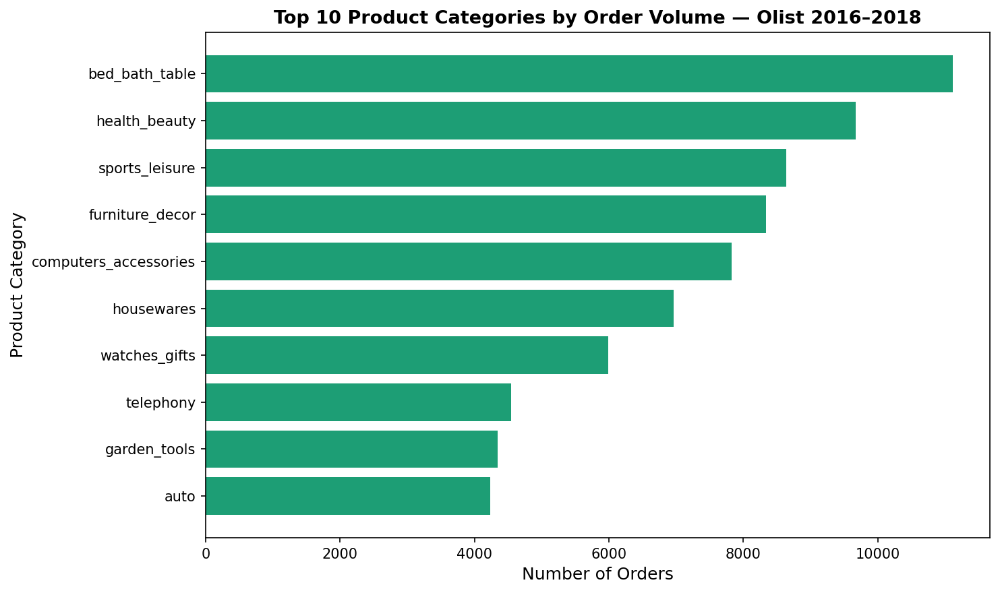
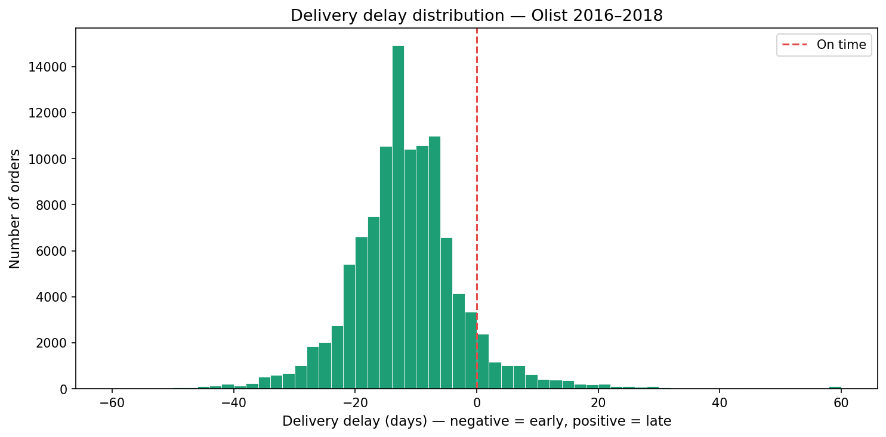
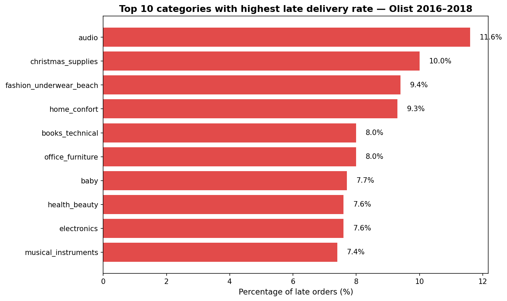
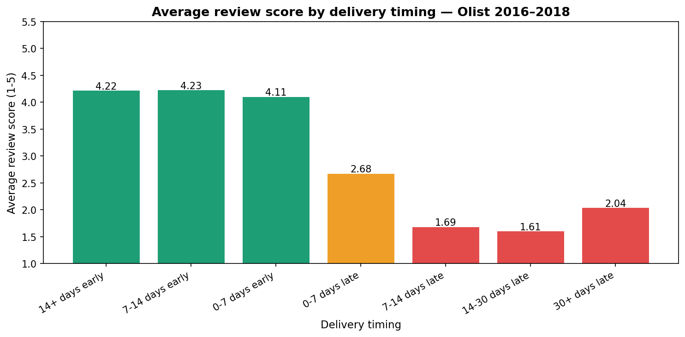
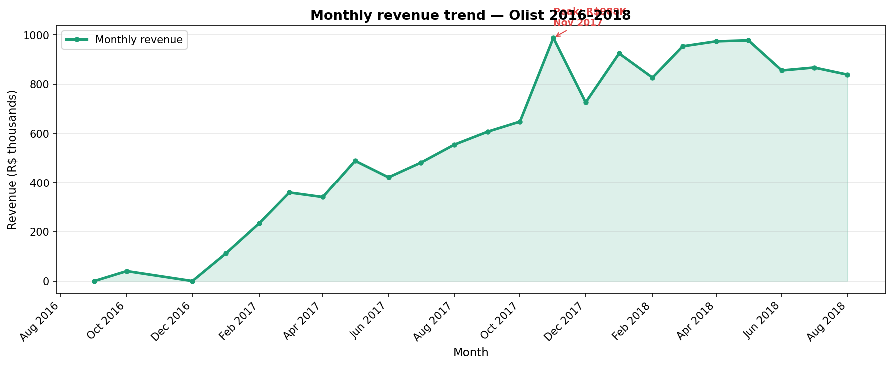
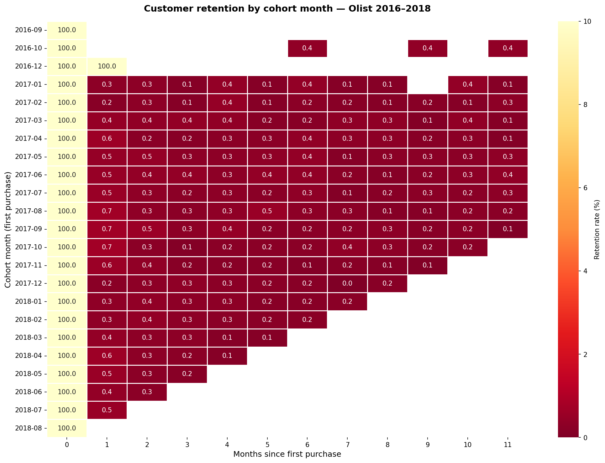
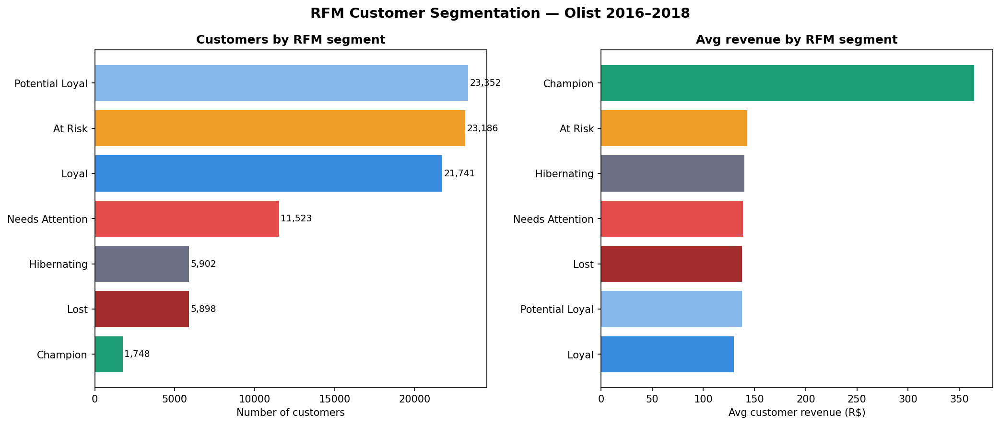
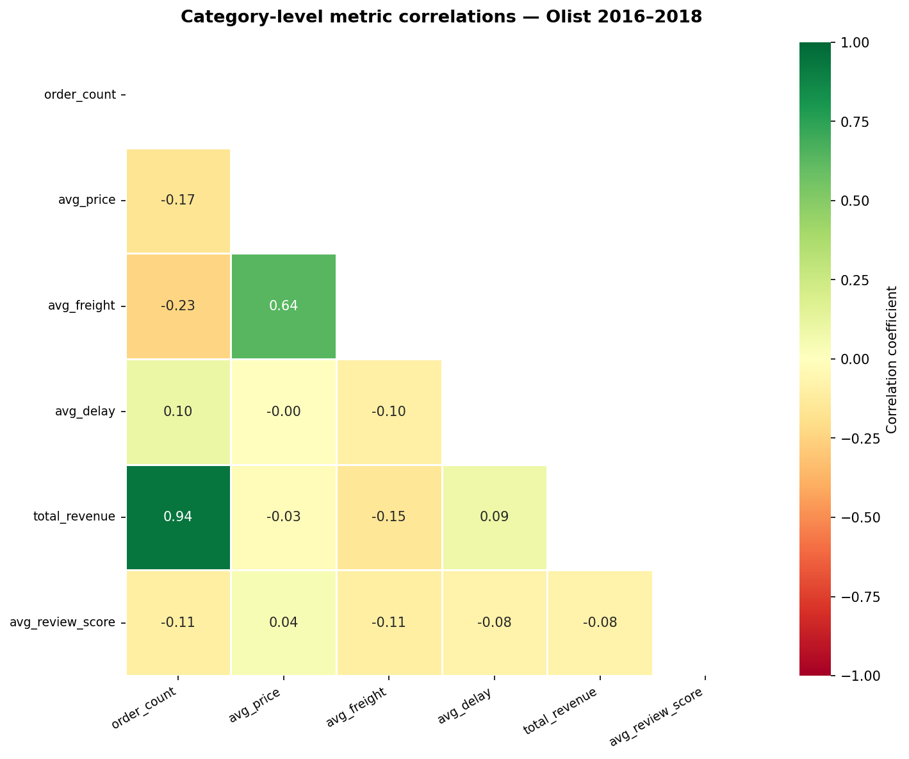
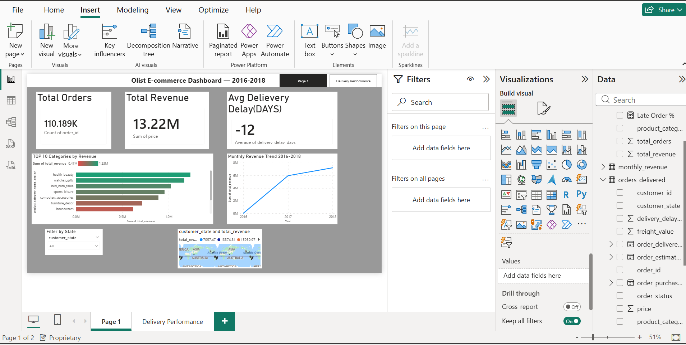
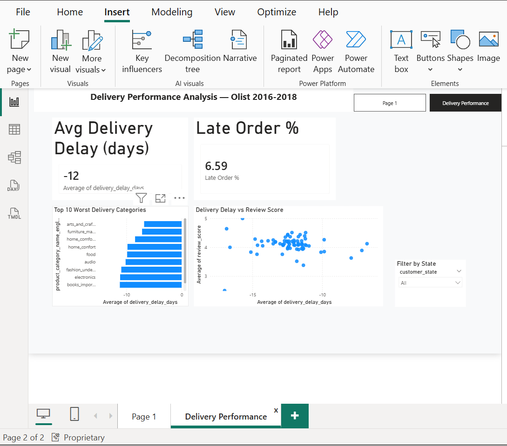

# Olist E-commerce Analysis

Analysing 100,000+ real orders from Olist — Brazil's largest
e-commerce marketplace (2016–2018).

## Business Questions — All 3 Answered

**Q1 — Which product categories have the worst delivery delays?**
audio leads with 11.6% late order rate. christmas_supplies 10.0%.
health_beauty appears despite being 2nd highest volume category —
significant absolute number of unhappy customers.

**Q2 — Does late delivery cause 1-star reviews?**
Yes. 67.5% of orders delayed 5+ days receive 1-star reviews
(3,064 of 4,541 late orders). Correlation = -0.229 across
110,005 reviewed orders.

**Q3 — Which states and categories drive most revenue?**
SP leads with R$5.07M. bed_bath_table leads in order volume
but computers_accessories earns 2x more per order
(R$158 vs R$83).

## Key Findings

- 92.1% of orders arrive early — mean delay = -12 days
- 67.5% of orders delayed 5+ days get 1-star reviews
- audio category has highest late rate at 11.6%
- Credit card dominates payments (73.8%) — avg R$178.93
- 10-installment orders average R$429 vs R$109 single payment
- SP generates R$5.07M — nearly 3x second-place RJ
- BA (Bahia) has highest avg order value at R$134
- Only 1.8% of customers ever buy again — marketplace
  retention challenge confirmed
- Champion RFM segment (1,748 customers) spends 2.5x average
- Nov 2017 Black Friday peak = R$987,648 (+52.4% MoM)

## Tools Used
Python · pandas · matplotlib · seaborn · SQL · SQLite ·
Excel · SUMIF · COUNTIF · Power BI · DAX · Streamlit

## Project Status
Week 1 complete — foundations, EDA, data cleaning
Week 2 complete — delivery analysis, review correlation,
payment methods, geographic breakdown
Week 3 complete — time series, cohort analysis, RFM
segmentation, correlation heatmap, Power BI dashboard
Week 4 in progress — Streamlit app, advanced SQL

## Dataset
[Brazilian E-Commerce Public Dataset — Kaggle](https://www.kaggle.com/datasets/olistbr/brazilian-ecommerce)

## Screenshots

